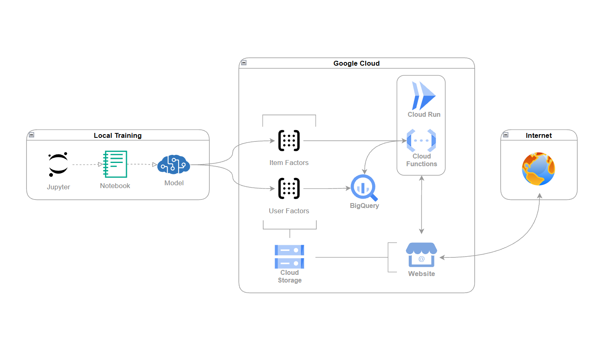

# Motor de Recomendaciones ALS · Steam

TFM — Máster en Ciencia de Datos y Analítica de Negocio, Universidad Complutense de Madrid (UCM).

Motor de recomendaciones de videojuegos entrenado con **ALS (Alternating Least Squares)** sobre más de 100 millones de reseñas de Steam, desplegado en Google Cloud para servir recomendaciones en tiempo real.

🔗 **Demo:** https://storage.googleapis.com/ucm-tfm-recommender-frontend/index.html

---

## Definición del proyecto

A partir de las reseñas de usuarios en Steam, se entrena un modelo de filtrado colaborativo que aprende los gustos de cada usuario y las similitudes entre videojuegos. El modelo entrenado se despliega como una API capaz de servir recomendaciones en milisegundos, simulando un ambiente de alta demanda en tiempo real mediante un sitio web de prueba.

## Arquitectura



- **Entrenamiento** (local): se entrena el modelo de Factorización de Matrices con ALS. Hardware requerido CPU.
- **Artefactos**: los vectores de usuarios e ítems (`item_factors`, `user_factors`) se exportan a **Cloud Storage**, pero para referencia se prepara una copia en Drive.
- **Inferencia**: una API en **Cloud Run** calcula recomendaciones en tiempo real a partir de estos vectores, apoyándose en **BigQuery** para metadatos (imágenes, nombres de juegos).
- **Frontend**: un sitio web estático consume la API y muestra las recomendaciones.

## Estructura del repositorio
```
notebooks/
    - 00_convierte_formato_archivos.ipynb       # Transformaciones de archivos preliminares
    - 01_exploracion_etl.ipynb                  # Limpieza y preparación de datos
    - 02_modelado_als.ipynb                     # Entrenamiento, evaluación y tuneo de hiperparámetros
    - 03_modelado_als_solo_juegos.ipynb.ipynb   # Modelo paralelo sin incluir DLC/Herramientas
    - 99_extrae_artefactos.ipynb                # Exportación de los vectores para el despliegue

cloud_run/
    - recommender-service/                      # Contenedor con API de inferencia (FastAPI)
        - Dockerfile
        - main.py
        - requirements.txt
    - deploy_CloudRun_cmd.txt                   # Comandos usados para desplegar en Cloud Run

scripts/                                        # Scripts utilitarios para transformaciones de archivo
    - convert_100m_reviews_in_chunks.py
    - convert_csv_to_parquet

website/
    index.html                                  # Sitio web de pruebas de concepto

```
Los archivos y artefactos pueden descargarse desde:
https://drive.google.com/drive/folders/1XKHzyk4DphhU-r7lNg6CxGPfTUCHuTnc?usp=sharing

```
artifacts/                                      # Almacena los artefactos (item/user) y tablas map
    - item_factors.npz                          # Contiene los 24 factores de items
    - user_factors.parquet                      # Contiene los 24 factores de usuarios
    - item_map.parquet                          # Map item_id <-> item_idx
    - user_map.parquet                          # Map user_id <-> user_idx
datasets/                                       # Contiene los dataset CSV, asi como sus transformaciones a parquet
    - Kaggle - 100 Million+ Steam Reviews       # No incluido, CSV disponible desde Kaggle
    - Kaggle - Gaming Profiles 2025             # No incluido, CSV disponible desde Kaggle
    - Kaggle - Steam Games Dataset              # No incluido, CSV disponible desde Kaggle
    - parquet/
        games/
            - games.parquet                     # Catálogo de juegos en formato parquet
        reviews/
            processed/
                - steam_reviews_clean.parquet   # Archivo reducido y preparado con la informacion necesaria
models/                                         # Directorio para los modelos entrenados
    - Raw/
        - als_model.npz                         # Modelo 0. 8.51 GB
    - Tunned/
        - als_model.npz                         # Modelo final. 1.5 GB

```


## Resultados principales

| Métrica | Valor |
|---|---|
| Reseñas usadas en el entrenamiento final | ~93 millones |
| Usuarios / Juegos | 17M / 78,376 |
| Factores latentes | 24 |
| HitRate@10 | 0.144 |
| Mejora vs. recomendación aleatoria | ~830x |
| Mejora vs. ranking de popularidad | +21% |

| Archivos de vectores | Tamaño |
|---|---|
| item_factors.npz | 7.2 MB |
| user_factors.parquet | 1.7 GB |


## Stack

Python · [`implicit`](https://github.com/benfred/implicit) (ALS) · Pandas · Parquet · FastAPI · Docker · Google Cloud (Cloud Run, Cloud Storage, BigQuery)

## Licencias

- Librería `implicit` — Copyright (c) 2016 Ben Frederickson, licencia MIT.
- Datasets utilizados (Kaggle) — licencia MIT.

---

**Autor:** Max Mondragón — TFM, UCM 2026
